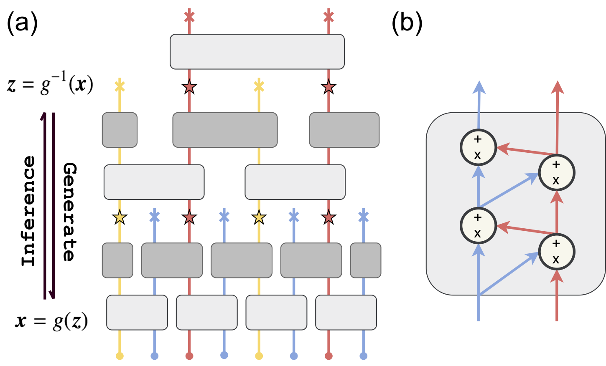

# NerualRG 

Pytorch implement of arXiv paper: Shuo-Hui Li and Lei Wang, *Neural Network Renormalization Group* [arXiv:1802.02840](https://arxiv.org/abs/1802.02840).

**NeuralRG** is a deep generative model using variational renormalization group approach, it is composed by layers of bijectors (In our implementation, we use [RealNVP](https://arxiv.org/abs/1605.08803)). After training, it can generate statistically independent physical configurations with tractable likelihood via directly sampling.

## How does NerualRG work

In NerualRG Network(a), we use realNVP (b) networks as building blocks, realNVP is a kind of bijectors, they can transform one distribution into other distribution and revert this process. For multi-in-multi-out blocks, we call they disentanglers(gray blocks in (a)), and for multi-in-single-out blocks, we can they decimators(white blocks in (a)). And stacking multiply layers of these blocks into a hierarchical structure forms NerualRG network, so NerualRG is also a bijector. In inference process, each layer tries to "separate" entangled variables into independent variables, and at layers composed of decimators, we only keep one of these independent variables, this is renormalization group.



The structure we used to construct realNVP networks into NeuralRG network is inspired by multi-scale entanglement renormalization ansatz (MERA), as shown in (a). Also, the process of variable going through our network can be viewed as a renormalization process.

The resulted effect of a trained NeuralRG network can be visualized using gradients plot (a) and MI plot of variables of the same layer (b).


## How to Run 

### Train

Use `main.py` to train model. Options available are:

* `folder` specifies saving path. At that path a `parameters.hdf5` will be created to keep training parameters, a `pic` folder will be created to keep plots, a `records` folder will be created to keep saved HMC records, and a `savings` folder to save models in.
* `name` specifies model's name. If not specified, a name will be created according to training parameters.
* `epochs`, `batch`, `lr`, `savePeriod` are the number of training epochs, batch size, learning rate, the number of epochs before saving.
* `cuda` indicates on which GPU card should the model be trained, the default value is -1, which means running on CPU.
* `double` indicates if use double float.
* `load` indicates if load a pre-trained model. If true, will try to find a pre-trained model at where `folder` suggests. Note that if true all other parameters will be overwritten with what saved in `folder`'s `parameters.hdf5`.
*  `nmlp`, `nhidden` are used to construct MLP networks inside of realNVP networks. `nmlp` is the number of layers in MLP networks and `nhidden` is the number of hidden neurons in each layer.
* `nlayers` is used to construct realNVP networks, it suggests how many layers in each realNVP networks.
* `nrepeat` is used to construct MERA network, it suggests how many layers of bijectors inside of each layer of MERA network.
* `L`, `d`, `T` are used to construct the Ising model to learn, `L` is the size of configuration, `d` is the dimension, and `T` is the temperature.

### Plot

Use `plot.py` to plot the loss curve and HMC result results. Options available are:

* `folder` specifies saving path. `plot.py` will use the data saved in that path to plot. And if `save` is true, the plot will be saved in `folder`'s `pic` folder.
* `per` specifies how many seconds between each refresh.
* `show`, `save` specifies if will show/save the plot.
* `exact` specifies the exact result of HMC.

## Citation

If you use this code for your research, please cite our [paper](https://arxiv.org/abs/1802.02840):

```
@article{nerualRG,
  Author = {Shuo-Hui Li and Lei Wang},
  Title = {Neural Network Renormalization Group},
  Year = {2018},
  Eprint = {arXiv:1802.02840},
}
```

## Contact

For questions and suggestions, contact Shuo-Hui Li at [contact_lish@iphy.ac.cn](mailto:contact_lish@iphy.ac.cn).


